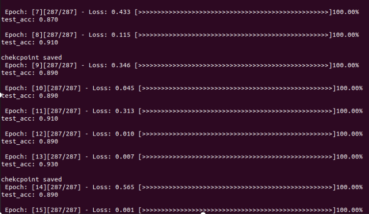
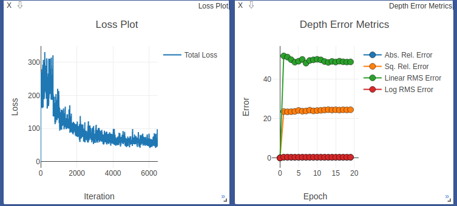
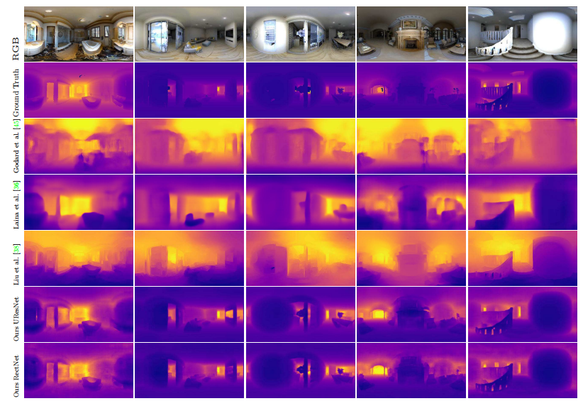
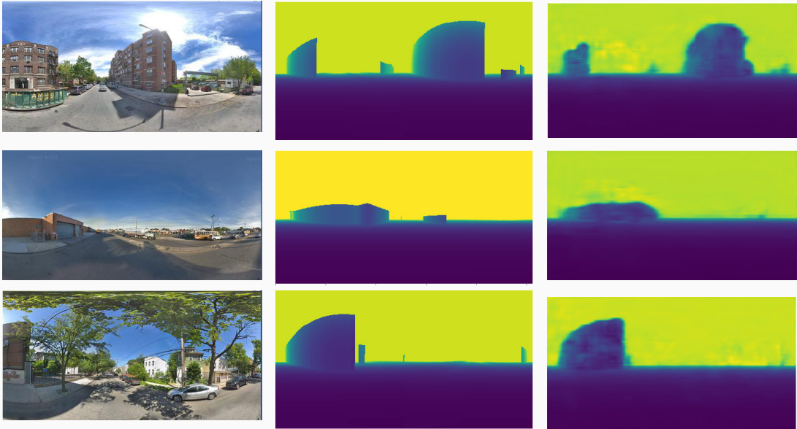

### OmniDepth-Pytorch
A PyTorch reimplementation of the Omnidepth paper from Zioulis et al., ECCV 2018:

Notable difference with the paper: PyTorch's weight decay for the Adam solver does not seem to function the same way as Caffe's. Hence, I do not use weight decay in training. Instead, I use a learning rate schedule

this project is riched some trainning visualizations based on others

### Dependencies
- Python 3.7
- Pytorch 1.1
- Visdom 0.1.8

### Show

### Credit
- fork from https://github.com/meder411/OmniDepth-PyTorch

- If you do use this repository, please make sure to cite the authors' original paper:
Zioulis, Nikolaos, et al. "OmniDepth: Dense Depth Estimation for Indoors Spherical Panoramas." 
Proceedings of the European Conference on Computer Vision (ECCV). 2018.
